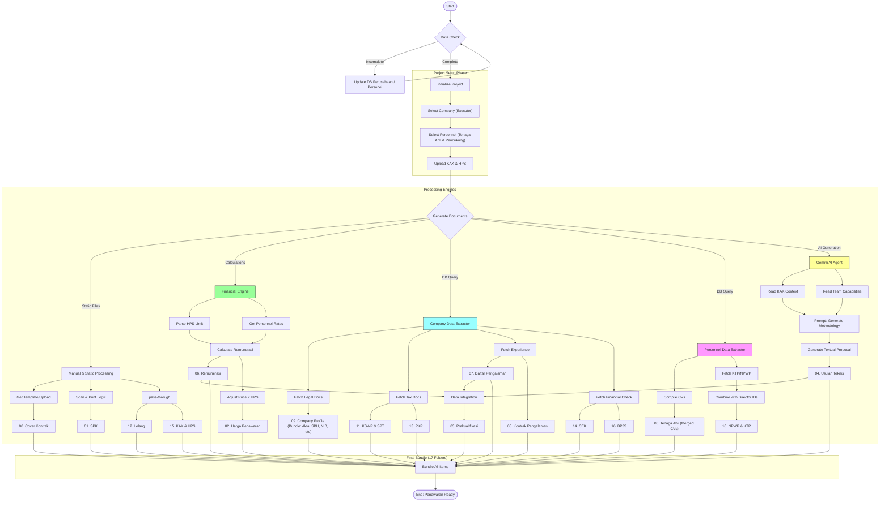

# System Architecture - KPN Fast Project

## High Level Overview

This document describes the high-level architecture of the KPN Fast system, focusing on the "Penawaran" (Project Offer) generation workflow. The system integrates existing Company and Personnel databases with project-specific inputs (KAK, HPS) and leverages AI (Gemini) to generate technical proposals.

## System Context Diagram

```mermaid
graph TD
    User(("User / Staff"))

    subgraph "Data Sources (Databases)"
        DB_Comp[("Database Perusahaan")]
        DB_Pers[("Database Personel")]
    end

    subgraph "Project Input"
        Input_KAK["Input KAK (Kerangka Acuan Kerja)"]
        Input_HPS["Input HPS (Harga Perkiraan Sendiri)"]
    end

    subgraph "Core System (KPN Fast)"
        Project_Mgr["Project Manager Module"]
        Doc_Gen["Document Generator Engine"]
        AI_Agent["Gemini AI Agent"]
        Calc_Engine["Cost & Remuneration Calculator"]
    end

    subgraph "Output: Penawaran (17 Items)"
        Out_00["00. Cover Kontrak"]
        Out_01["01. SPK"]
        Out_02["02. Harga Penawaran"]
        Out_03["03. Prakualifikasi"]
        Out_04["04. Usulan Teknis (AI)"]
        Out_05["05. Tenaga Ahli"]
        Out_06["06. Remunerasi"]
        Out_07["07. Daftar Pengalaman"]
        Out_08["08. Kontrak Pengalaman"]
        Out_09["09. Company Profile"]
        Out_10["10. NPWP & KTP"]
        Out_11["11. KSWP & SPT"]
        Out_12["12. Lelang"]
        Out_13["13. PKP"]
        Out_14["14. CEK"]
        Out_15["15. KAK & HPS"]
        Out_16["16. BPJS"]
    end

    %% Relations
    User -- "1. Fill Data" --> DB_Comp
    User -- "1. Fill Data" --> DB_Pers
    User -- "2. Create Project" --> Project_Mgr
    User -- "3. Upload" --> Input_KAK
    User -- "3. Upload" --> Input_HPS

    Project_Mgr -- "Select Executor" --> DB_Comp
    Project_Mgr -- "Select Team" --> DB_Pers
    Project_Mgr -- "Trigger Generation" --> Doc_Gen

    Input_KAK --> Doc_Gen
    Input_HPS --> Calc_Engine

    Doc_Gen -- "Fetch Corp Docs" --> DB_Comp
    Doc_Gen -- "Fetch Person Docs" --> DB_Pers

    %% AI Generation Logic for Usulan Teknis
    Input_KAK --> AI_Agent
    DB_Comp --> AI_Agent
    DB_Pers --> AI_Agent
    AI_Agent -- "Generate Content" --> Out_04

    %% Calculator Logic
    DB_Pers --> Calc_Engine
    Input_HPS --> Calc_Engine
    Calc_Engine --> Out_06
    Calc_Engine --> Out_02

    %% Direct Mapping / Composition
    Project_Mgr --> Out_00
    Project_Mgr --> Out_01

    Doc_Gen --> Out_03
    Doc_Gen --> Out_05
    Doc_Gen --> Out_07
    Doc_Gen --> Out_08
    Doc_Gen --> Out_09
    Doc_Gen --> Out_10
    Doc_Gen --> Out_11
    Doc_Gen --> Out_12
    Doc_Gen --> Out_13
    Doc_Gen --> Out_14
    Doc_Gen --> Out_15
    Doc_Gen --> Out_16

    %% Styling
    style AI_Agent fill:#f9f,stroke:#333,stroke-width:2px,color:black
    style Doc_Gen fill:#bbf,stroke:#333,stroke-width:2px,color:black
    style Project_Mgr fill:#bfb,stroke:#333,stroke-width:2px,color:black
```

## Detailed Data Flow for "Penawaran" Generation

The following flowchart details the step-by-step process from data entry to the generation of the 17 output items.

